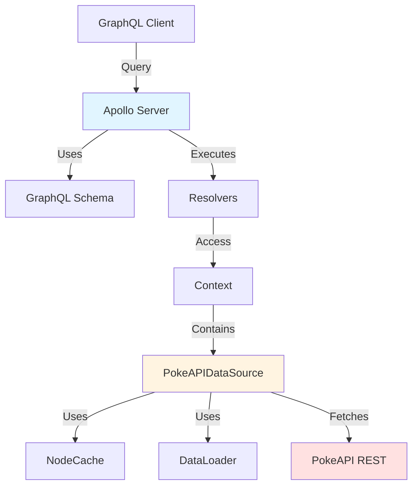
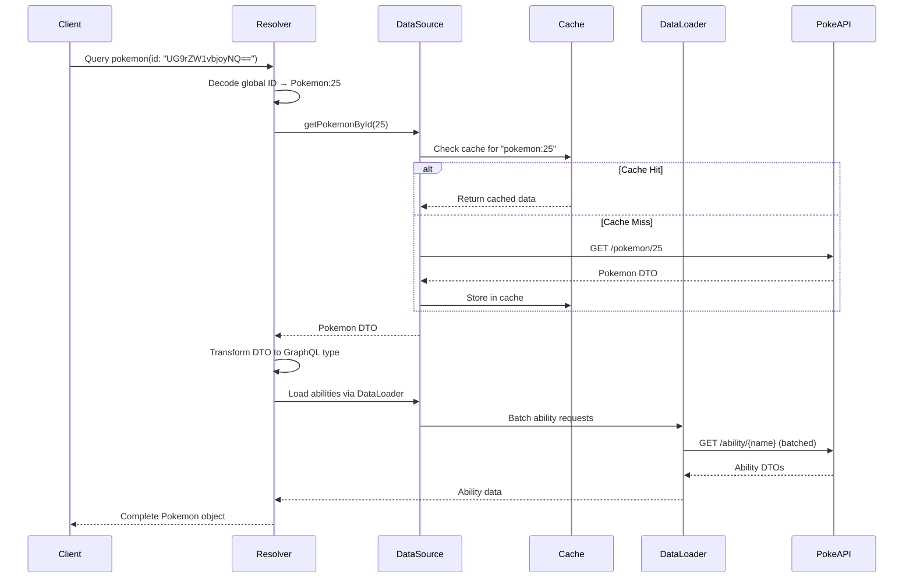

# Design Document

## Overview

This design document outlines the architecture for implementing a comprehensive GraphQL API that exposes all 48 PokeAPI v2 resource types through a Relay-compliant interface. The implementation will extend the existing Apollo Server application with new schema types, resolvers, and DataSource methods while maintaining the current patterns for caching, batching, and error handling.

The design follows a layered architecture:
1. **Schema Layer**: GraphQL type definitions in `.graphql` files
2. **Resolver Layer**: Type-specific resolver functions that transform DTOs to GraphQL types
3. **DataSource Layer**: PokeAPIDataSource class with caching and batching logic
4. **Utility Layer**: Helper functions for Relay patterns (global IDs, cursors, pagination)

## Architecture

### High-Level Component Diagram



### Data Flow



## Components and Interfaces

### 1. Co-located Domain Organization

All related code for each domain will be co-located in domain-specific directories:

```
src/
├── schema/
│   └── relay.graphql          # Shared Node interface, PageInfo
├── domains/
│   ├── pokemon/
│   │   ├── pokemon.dto.ts     # DTOs for Pokemon, PokemonSpecies, PokemonForm
│   │   ├── pokemon.graphql    # GraphQL schema for Pokemon types
│   │   ├── PokemonDataSource.ts  # DataSource for Pokemon domain
│   │   ├── pokemon.resolver.ts   # Pokemon type resolver
│   │   ├── pokemonSpecies.resolver.ts  # PokemonSpecies resolver
│   │   ├── pokemonForm.resolver.ts     # PokemonForm resolver
│   │   └── edges/
│   │       ├── pokemonAbility.edge.ts  # PokemonAbilityEdge resolver
│   │       ├── pokemonType.edge.ts     # PokemonTypeEdge resolver
│   │       ├── pokemonMove.edge.ts     # PokemonMoveEdge resolver
│   │       └── pokemonStat.edge.ts     # PokemonStatEdge resolver
│   ├── ability/
│   │   ├── ability.dto.ts
│   │   ├── ability.graphql
│   │   ├── AbilityDataSource.ts
│   │   ├── ability.resolver.ts
│   │   └── edges/
│   │       └── abilityPokemon.edge.ts
│   ├── move/
│   │   ├── move.dto.ts
│   │   ├── move.graphql
│   │   ├── MoveDataSource.ts
│   │   ├── move.resolver.ts
│   │   ├── moveAilment.resolver.ts
│   │   ├── moveDamageClass.resolver.ts
│   │   └── edges/
│   │       └── movePokemon.edge.ts
│   ├── type/
│   │   ├── type.dto.ts
│   │   ├── type.graphql
│   │   ├── TypeDataSource.ts
│   │   ├── type.resolver.ts
│   │   └── edges/
│   │       ├── typePokemon.edge.ts
│   │       └── typeMove.edge.ts
│   ├── item/
│   │   ├── item.dto.ts
│   │   ├── item.graphql
│   │   ├── ItemDataSource.ts
│   │   ├── item.resolver.ts
│   │   ├── itemCategory.resolver.ts
│   │   └── itemAttribute.resolver.ts
│   ├── location/
│   │   ├── location.dto.ts
│   │   ├── location.graphql
│   │   ├── LocationDataSource.ts
│   │   ├── location.resolver.ts
│   │   ├── locationArea.resolver.ts
│   │   ├── region.resolver.ts
│   │   └── edges/
│   │       └── pokemonEncounter.edge.ts
│   ├── evolution/
│   │   ├── evolution.dto.ts
│   │   ├── evolution.graphql
│   │   ├── EvolutionDataSource.ts
│   │   ├── evolutionChain.resolver.ts
│   │   └── evolutionTrigger.resolver.ts
│   ├── berry/
│   │   ├── berry.dto.ts
│   │   ├── berry.graphql
│   │   ├── BerryDataSource.ts
│   │   ├── berry.resolver.ts
│   │   ├── berryFlavor.resolver.ts
│   │   ├── berryFirmness.resolver.ts
│   │   └── edges/
│   │       └── berryFlavor.edge.ts
│   ├── game/
│   │   ├── game.dto.ts
│   │   ├── game.graphql
│   │   ├── GameDataSource.ts
│   │   ├── generation.resolver.ts
│   │   ├── version.resolver.ts
│   │   ├── versionGroup.resolver.ts
│   │   └── pokedex.resolver.ts
│   ├── stat/
│   │   ├── stat.dto.ts
│   │   ├── stat.graphql
│   │   ├── StatDataSource.ts
│   │   ├── stat.resolver.ts
│   │   ├── characteristic.resolver.ts
│   │   └── nature.resolver.ts
│   ├── contest/
│   │   ├── contest.dto.ts
│   │   ├── contest.graphql
│   │   ├── ContestDataSource.ts
│   │   ├── contestType.resolver.ts
│   │   ├── contestEffect.resolver.ts
│   │   └── superContestEffect.resolver.ts
│   ├── encounter/
│   │   ├── encounter.dto.ts
│   │   ├── encounter.graphql
│   │   ├── EncounterDataSource.ts
│   │   ├── encounterMethod.resolver.ts
│   │   ├── encounterCondition.resolver.ts
│   │   └── encounterConditionValue.resolver.ts
│   ├── machine/
│   │   ├── machine.dto.ts
│   │   ├── machine.graphql
│   │   ├── MachineDataSource.ts
│   │   └── machine.resolver.ts
│   ├── base/
│   │   ├── BasePokeAPIDataSource.ts  # Shared base class
│   │   └── common.dto.ts             # Shared DTOs (NamedAPIResource, etc.)
│   └── index.ts                      # Aggregates all resolvers
├── utils/
│   ├── relay.ts
│   └── cursor.ts
├── context.ts
└── index.ts
```

**Design Decision**: 
- **Co-location**: Everything related to a domain (DTOs, schema, DataSource, resolvers) lives in one directory
- **Discoverability**: Easy to find all code related to a specific feature
- **Maintainability**: Changes to a domain only affect files in that domain's directory
- **Scalability**: New domains can be added as new directories without touching existing code
- **Clear boundaries**: Each domain is self-contained with clear interfaces

### 2. Naming Conventions

**CRITICAL: All DTOs MUST use the "DTO" suffix to avoid naming conflicts with generated GraphQL types.**

#### DTO Naming Rules

1. **All PokeAPI response types use DTO suffix**:
   - `PokemonDTO`, `AbilityDTO`, `MoveDTO`, `TypeDTO`, etc.
   - `NamedAPIResourceDTO`, `APIResourceDTO` (common types)
   - `EffectEntryDTO`, `FlavorTextEntryDTO`, `SpritesDTO` (nested types)

2. **Rationale**: 
   - GraphQL Code Generator creates types like `Pokemon`, `Ability`, `Move` from schema
   - DTOs represent PokeAPI REST responses (different structure)
   - Without suffix, TypeScript would have naming conflicts
   - Example: `Pokemon` (GraphQL type) vs `PokemonDTO` (PokeAPI response)

3. **File naming**:
   - DTO files: `{domain}.dto.ts` (e.g., `pokemon.dto.ts`)
   - Schema files: `{domain}.graphql` (e.g., `pokemon.graphql`)
   - DataSource files: `{Domain}DataSource.ts` (e.g., `PokemonDataSource.ts`)
   - Resolver files: `{domain}.resolver.ts` (e.g., `pokemon.resolver.ts`)

4. **Examples**:
   ```typescript
   // ✅ CORRECT - DTOs have suffix
   export interface PokemonDTO { ... }
   export interface NamedAPIResourceDTO { ... }
   export interface SpritesDTO { ... }
   
   // ❌ WRONG - Missing DTO suffix
   export interface Pokemon { ... }
   export interface NamedAPIResource { ... }
   export interface Sprites { ... }
   ```

5. **Common DTOs** (in `domains/base/common.dto.ts`):
   - `NamedAPIResourceDTO` - Named resource reference
   - `APIResourceDTO` - Unnamed resource reference
   - `NamedAPIResourceListDTO` - Paginated named list
   - `APIResourceListDTO` - Paginated unnamed list
   - `NameDTO` - Localized name
   - `EffectEntryDTO` - Effect text
   - `FlavorTextEntryDTO` - Flavor text
   - `GameIndexDTO` - Game index
   - `DescriptionDTO` - Description text
   - `SpritesDTO` - Sprite URLs
   - `VersionEncounterDetailDTO` - Encounter details
   - `EncounterDetailDTO` - Encounter metadata

### 3. Core Type Patterns

#### Node Interface Implementation

All entity types with IDs implement the Node interface:

```graphql
interface Node {
  id: ID!
}

type Pokemon implements Node {
  id: ID!
  name: String!
  # ... other fields
}
```

**Global ID Format**: `base64("TypeName:localId")`
- Example: `base64("Pokemon:25")` → `"UG9rZW1vbjoyNQ=="`
- Decoding extracts typename for routing in node resolver

#### Connection Pattern

All paginated lists follow Relay Connection specification:

```graphql
type PokemonConnection {
  edges: [PokemonEdge!]!
  pageInfo: PageInfo!
  totalCount: Int!
}

type PokemonEdge {
  cursor: String!
  node: Pokemon!
}

type PageInfo {
  hasNextPage: Boolean!
  hasPreviousPage: Boolean!
  startCursor: String
  endCursor: String
}
```

**Cursor Format**: `base64("offset:number")`
- Encodes the offset position in the result set
- Opaque to clients, validated on decode

#### Edge Pattern for Relationships

Many-to-many relationships with metadata use Edge types:

```graphql
type PokemonAbilityConnection {
  edges: [PokemonAbilityEdge!]!
}

type PokemonAbilityEdge {
  slot: Int!
  isHidden: Boolean!
  node: Ability!
}
```

**Design Decision**: Edge types encapsulate relationship metadata (slot, isHidden, level, etc.) while maintaining clean separation between entities. This pattern will be used for:
- Pokemon ↔ Abilities (slot, isHidden)
- Pokemon ↔ Types (slot)
- Pokemon ↔ Moves (learnMethod, level, versionGroup)
- Pokemon ↔ Stats (baseStat, effort)
- Location ↔ Pokemon (encounters with chance, minLevel, maxLevel)
- And other many-to-many relationships

### 3. DataSource Architecture

#### Co-located DataSource Organization

DataSources are co-located with their domain code (see directory structure above). Each domain has:
- DTOs defining the PokeAPI response structure
- DataSource class for fetching that domain's data
- GraphQL schema for that domain
- Resolvers for that domain's types

**Design Decision**: 
- **Co-location**: DataSource lives with DTOs, schema, and resolvers in domain directory
- **Shared Base Class**: BasePokeAPIDataSource (in domains/base/) provides common functionality
- **Shared Cache**: All DataSources share the same NodeCache instance for cross-request caching
- **Maintainability**: All code for a domain is in one place
- **Testability**: Each DataSource can be tested independently
- **Scalability**: New domains can be added as new directories

#### Context Updates

The Context interface will be updated to include all specialized DataSources:

```typescript
import { PokemonDataSource } from "./datasources/PokemonDataSource.js";
import { AbilityDataSource } from "./datasources/AbilityDataSource.js";
// ... other imports

export interface Context {
  dataSources: {
    pokemon: PokemonDataSource;
    ability: AbilityDataSource;
    move: MoveDataSource;
    type: TypeDataSource;
    item: ItemDataSource;
    location: LocationDataSource;
    evolution: EvolutionDataSource;
    berry: BerryDataSource;
    game: GameDataSource;
    stat: StatDataSource;
    contest: ContestDataSource;
    encounter: EncounterDataSource;
    machine: MachineDataSource;
  };
}

export function createContext(): Context {
  const baseURL = process.env.POKEAPI_BASE_URL || "https://pokeapi.co/api/v2";
  const config = { baseURL };

  return {
    dataSources: {
      pokemon: new PokemonDataSource(config),
      ability: new AbilityDataSource(config),
      move: new MoveDataSource(config),
      type: new TypeDataSource(config),
      item: new ItemDataSource(config),
      location: new LocationDataSource(config),
      evolution: new EvolutionDataSource(config),
      berry: new BerryDataSource(config),
      game: new GameDataSource(config),
      stat: new StatDataSource(config),
      contest: new ContestDataSource(config),
      encounter: new EncounterDataSource(config),
      machine: new MachineDataSource(config),
    },
  };
}
```

**Resolver Access Pattern**:
```typescript
// Old pattern
const pokemon = await context.dataSources.pokeapi.getPokemonById(id);

// New pattern
const pokemon = await context.dataSources.pokemon.getPokemonById(id);
const ability = await context.dataSources.ability.getAbilityById(id);
```

#### Base DataSource Class

```typescript
import NodeCache from "node-cache";
import DataLoader from "dataloader";

// Shared cache instance across all DataSources
const cache = new NodeCache({ useClones: true });

export abstract class BasePokeAPIDataSource {
  protected baseURL: string;
  protected cache: NodeCache;
  
  constructor(config: { baseURL: string }) {
    this.baseURL = config.baseURL;
    this.cache = cache; // Shared cache
  }
  
  // Shared fetch method with error handling
  protected async fetch<T>(url: string): Promise<T | null> {
    try {
      const response = await fetch(url);
      if (response.status === 404 || !response.ok) {
        return null;
      }
      return await response.json() as T;
    } catch (error) {
      if (error instanceof Error && error.message.includes("fetch")) {
        throw new Error(`Network error: Unable to reach PokeAPI - ${error.message}`);
      }
      throw error;
    }
  }
  
  // Helper to create DataLoader with caching
  protected createLoader<K, V>(
    fetchFn: (key: K) => Promise<V | null>,
    cacheKeyPrefix: string
  ): DataLoader<K, V | null> {
    return new DataLoader<K, V | null>(
      async (keys) => {
        return Promise.all(keys.map(key => fetchFn(key)));
      },
      { cache: true }
    );
  }
}
```

#### Specialized DataSource Example

```typescript
import { BasePokeAPIDataSource } from "../base/BasePokeAPIDataSource.js";
import type { PokemonDTO, PokemonSpeciesDTO, PokemonFormDTO } from "./pokemon.dto.js";
import DataLoader from "dataloader";

export class PokemonDataSource extends BasePokeAPIDataSource {
  // DataLoaders for this domain
  public pokemonByIdLoader: DataLoader<number, PokemonDTO | null>;
  public pokemonByNameLoader: DataLoader<string, PokemonDTO | null>;
  public speciesByIdLoader: DataLoader<number, PokemonSpeciesDTO | null>;
  public speciesByNameLoader: DataLoader<string, PokemonSpeciesDTO | null>;
  public formByIdLoader: DataLoader<number, PokemonFormDTO | null>;
  public formByNameLoader: DataLoader<string, PokemonFormDTO | null>;
  
  constructor(config: { baseURL: string }) {
    super(config);
    
    // Initialize loaders
    this.pokemonByIdLoader = this.createLoader(
      (id: number) => this.fetchPokemonById(id),
      "pokemon"
    );
    
    this.pokemonByNameLoader = this.createLoader(
      (name: string) => this.fetchPokemonByName(name),
      "pokemon:name"
    );
    
    this.speciesByIdLoader = this.createLoader(
      (id: number) => this.fetchSpeciesById(id),
      "species"
    );
    
    // ... initialize other loaders
  }
  
  // Public API methods
  async getPokemonById(id: number): Promise<PokemonDTO | null> {
    return this.pokemonByIdLoader.load(id);
  }
  
  async getPokemonByName(name: string): Promise<PokemonDTO | null> {
    return this.pokemonByNameLoader.load(name);
  }
  
  // Private fetch methods
  private async fetchPokemonById(id: number): Promise<PokemonDTO | null> {
    const cacheKey = `pokemon:${id}`;
    const cached = this.cache.get<PokemonDTO>(cacheKey);
    if (cached) return cached;
    
    const url = `${this.baseURL}/pokemon/${id}`;
    const pokemon = await this.fetch<PokemonDTO>(url);
    if (pokemon) this.cache.set(cacheKey, pokemon);
    return pokemon;
  }
  
  private async fetchPokemonByName(name: string): Promise<PokemonDTO | null> {
    const cacheKey = `pokemon:name:${name}`;
    const cached = this.cache.get<PokemonDTO>(cacheKey);
    if (cached) return cached;
    
    const url = `${this.baseURL}/pokemon/${name}`;
    const pokemon = await this.fetch<PokemonDTO>(url);
    if (pokemon) {
      this.cache.set(cacheKey, pokemon);
      // Also cache by ID for consistency
      this.cache.set(`pokemon:${pokemon.id}`, pokemon);
    }
    return pokemon;
  }
  
  // ... other methods
}
```

#### DataSource Method Patterns

The PokeAPIDataSource class will implement consistent method patterns with DataLoader:

```typescript
// Public methods - use DataLoader for batching
async getPokemonById(id: number): Promise<PokemonDTO | null> {
  return this.pokemonByIdLoader.load(id);
}

async getPokemonByName(name: string): Promise<PokemonDTO | null> {
  return this.pokemonByNameLoader.load(name);
}

async getAbilityById(id: number): Promise<AbilityDTO | null> {
  return this.abilityByIdLoader.load(id);
}

async getAbilityByName(name: string): Promise<AbilityDTO | null> {
  return this.abilityByNameLoader.load(name);
}

// Private fetch methods - do actual HTTP + caching
private async fetchPokemonById(id: number): Promise<PokemonDTO | null> {
  const cacheKey = `pokemon:${id}`;
  const cached = cache.get<PokemonDTO>(cacheKey);
  if (cached) return cached;
  
  const url = `${this.baseURL}/pokemon/${id}`;
  const pokemon = await this.fetch<PokemonDTO>(url);
  if (pokemon) cache.set(cacheKey, pokemon);
  return pokemon;
}

// Paginated list - direct fetch (not batched, but cached)
async getPokemonList(limit: number, offset: number): Promise<PokemonListResponse> {
  const cacheKey = `list:pokemon:${limit}:${offset}`;
  const cached = cache.get<PokemonListResponse>(cacheKey);
  if (cached) return cached;
  
  const url = `${this.baseURL}/pokemon?limit=${limit}&offset=${offset}`;
  const list = await this.fetch<PokemonListResponse>(url);
  cache.set(cacheKey, list);
  return list;
}
```

**Pattern Summary**:
- **Public methods**: Use DataLoader (getPokemonById, getAbilityByName, etc.)
- **Private methods**: Do actual fetching with cache checks (fetchPokemonById, fetchAbilityByName, etc.)
- **List methods**: Direct fetch with caching (not batched since lists are unique by limit/offset)
- **All methods**: Check NodeCache before HTTP requests

**Caching Strategy**:
- **Two-level caching**: NodeCache (cross-request) + DataLoader (per-request)
- Cache key format: `"{resourceType}:{id}"` or `"{resourceType}:name:{name}"`
- List cache key format: `"list:{resourceType}:{limit}:{offset}"`
- TTL: No expiration (PokeAPI data is static)
- Cache storage: NodeCache (in-memory, per-server instance)
- **All fetch methods check NodeCache before making HTTP requests**
- **All public DataSource methods use DataLoader for batching and per-request caching**

**DataLoader Strategy**:
- **ALL fetch requests will use DataLoader** for automatic batching and per-request caching
- One DataLoader per resource type (by ID and by name where applicable)
- Loaders created per-request in context to ensure proper request isolation
- Batch functions fetch multiple resources in parallel
- DataLoader provides automatic deduplication within a single request

```typescript
export class PokeAPIDataSource {
  // DataLoaders for ALL resource types
  // By ID loaders
  public pokemonByIdLoader: DataLoader<number, PokemonDTO | null>;
  public abilityByIdLoader: DataLoader<number, AbilityDTO | null>;
  public moveByIdLoader: DataLoader<number, MoveDTO | null>;
  public typeByIdLoader: DataLoader<number, TypeDTO | null>;
  public itemByIdLoader: DataLoader<number, ItemDTO | null>;
  public locationByIdLoader: DataLoader<number, LocationDTO | null>;
  public berryByIdLoader: DataLoader<number, BerryDTO | null>;
  public evolutionChainByIdLoader: DataLoader<number, EvolutionChainDTO | null>;
  public pokemonSpeciesByIdLoader: DataLoader<number, PokemonSpeciesDTO | null>;
  public statByIdLoader: DataLoader<number, StatDTO | null>;
  public natureByIdLoader: DataLoader<number, NatureDTO | null>;
  public generationByIdLoader: DataLoader<number, GenerationDTO | null>;
  public versionByIdLoader: DataLoader<number, VersionDTO | null>;
  // ... more ID loaders for all 48 resource types
  
  // By name loaders (for named resources)
  public pokemonByNameLoader: DataLoader<string, PokemonDTO | null>;
  public abilityByNameLoader: DataLoader<string, AbilityDTO | null>;
  public moveByNameLoader: DataLoader<string, MoveDTO | null>;
  public typeByNameLoader: DataLoader<string, TypeDTO | null>;
  // ... more name loaders
  
  constructor(config: { baseURL: string }) {
    this.baseURL = config.baseURL;
    
    // Initialize ALL loaders
    this.pokemonByIdLoader = new DataLoader(async (ids) => {
      return Promise.all(ids.map(id => this.fetchPokemonById(id)));
    });
    
    this.pokemonByNameLoader = new DataLoader(async (names) => {
      return Promise.all(names.map(name => this.fetchPokemonByName(name)));
    });
    
    this.abilityByIdLoader = new DataLoader(async (ids) => {
      return Promise.all(ids.map(id => this.fetchAbilityById(id)));
    });
    
    this.abilityByNameLoader = new DataLoader(async (names) => {
      return Promise.all(names.map(name => this.fetchAbilityByName(name)));
    });
    
    // ... initialize all other loaders
  }
  
  // Public methods use loaders
  async getPokemonById(id: number): Promise<PokemonDTO | null> {
    return this.pokemonByIdLoader.load(id);
  }
  
  async getPokemonByName(name: string): Promise<PokemonDTO | null> {
    return this.pokemonByNameLoader.load(name);
  }
  
  // Private fetch methods do the actual HTTP + caching
  private async fetchPokemonById(id: number): Promise<PokemonDTO | null> {
    const cacheKey = `pokemon:${id}`;
    const cached = cache.get<PokemonDTO>(cacheKey);
    if (cached) return cached;
    
    const url = `${this.baseURL}/pokemon/${id}`;
    const pokemon = await this.fetch<PokemonDTO>(url);
    if (pokemon) cache.set(cacheKey, pokemon);
    return pokemon;
  }
}
```

**Design Decision**: Using DataLoader for ALL fetch requests provides:
1. **Automatic batching**: Multiple requests in the same tick are batched together
2. **Per-request caching**: Prevents duplicate fetches within a single GraphQL request
3. **Deduplication**: Multiple requests for the same resource return the same promise
4. **Performance**: Reduces HTTP requests and improves response times
5. **Consistency**: All data fetching follows the same pattern

### 4. Resolver Organization

Resolvers are co-located with their domain code (see directory structure in section 1). Each domain directory contains:
- Type resolvers (e.g., pokemon.resolver.ts, pokemonSpecies.resolver.ts)
- Edge resolvers in edges/ subdirectory (e.g., pokemonAbility.edge.ts)
- All resolvers for that domain's types

The main resolver aggregation happens in `src/domains/index.ts`:

```typescript
// src/domains/index.ts
import type { Resolvers } from "../types/generated.js";
import { Query } from "./query.js";
import { Node } from "./node.js";

// Import from each domain
import { Pokemon, PokemonSpecies, PokemonForm } from "./pokemon/index.js";
import { PokemonAbilityEdge, PokemonTypeEdge } from "./pokemon/edges/index.js";
import { Ability } from "./ability/index.js";
import { Move } from "./move/index.js";
// ... more imports

export const resolvers: Resolvers = {
  Query,
  Node,
  Pokemon,
  PokemonSpecies,
  PokemonForm,
  PokemonAbilityEdge,
  PokemonTypeEdge,
  Ability,
  Move,
  // ... all other resolvers
};
```

**Resolver Pattern**:

```typescript
import type { PokemonResolvers } from "../types/generated.js";
import { encodeGlobalId } from "../utils/relay.js";

export const Pokemon: PokemonResolvers = {
  // Scalar fields - direct mapping from DTO
  id: (parent) => encodeGlobalId("Pokemon", parent.id),
  name: (parent) => parent.name,
  height: (parent) => parent.height,
  
  // Reference fields - fetch related data using specialized DataSource
  species: async (parent, _args, context) => {
    const speciesId = extractIdFromUrl(parent.species.url);
    return context.dataSources.pokemon.getSpeciesById(speciesId);
  },
  
  // Connection fields - return edge structure
  abilities: (parent) => ({
    edges: parent.abilities.map((abilityRef) => ({
      slot: abilityRef.slot,
      isHidden: abilityRef.is_hidden,
      abilityName: abilityRef.ability.name, // Store name for edge resolver
    })),
  }),
};
```

**Edge Resolver Pattern**:

```typescript
import type { PokemonAbilityEdgeResolvers } from "../types/generated.js";

export const PokemonAbilityEdge: PokemonAbilityEdgeResolvers = {
  slot: (parent) => parent.slot,
  isHidden: (parent) => parent.isHidden,
  
  // Resolve the node using specialized DataSource with DataLoader for batching
  node: async (parent, _args, context) => {
    return context.dataSources.ability.getAbilityByName(parent.abilityName);
  },
};
```

### 5. Query Type Design

The Query type will expose all resources through two patterns:

1. **Single resource by global ID**: `pokemon(id: ID!): Pokemon`
2. **Paginated list**: `pokemons(first: Int, after: String): PokemonConnection!`

```graphql
type Query {
  # Node interface
  node(id: ID!): Node
  
  # Pokemon
  pokemon(id: ID!): Pokemon
  pokemons(
    """
    Number of items to return (1-50). If not provided, uses PokeAPI default (20).
    """
    first: Int
    """
    Cursor for pagination. Returns items after this cursor.
    """
    after: String
  ): PokemonConnection!
  
  # Abilities
  ability(id: ID!): Ability
  abilities(first: Int, after: String): AbilityConnection!
  
  # Moves
  move(id: ID!): Move
  moves(first: Int, after: String): MoveConnection!
  
  # Types
  type(id: ID!): Type
  types(first: Int, after: String): TypeConnection!
  
  # Items
  item(id: ID!): Item
  items(first: Int, after: String): ItemConnection!
  itemCategory(id: ID!): ItemCategory
  itemCategories(first: Int, after: String): ItemCategoryConnection!
  
  # Locations
  location(id: ID!): Location
  locations(first: Int, after: String): LocationConnection!
  region(id: ID!): Region
  regions(first: Int, after: String): RegionConnection!
  
  # Evolution
  evolutionChain(id: ID!): EvolutionChain
  evolutionChains(first: Int, after: String): EvolutionChainConnection!
  
  # Berries
  berry(id: ID!): Berry
  berries(first: Int, after: String): BerryConnection!
  
  # Game versions
  generation(id: ID!): Generation
  generations(first: Int, after: String): GenerationConnection!
  version(id: ID!): Version
  versions(first: Int, after: String): VersionConnection!
  
  # Stats
  stat(id: ID!): Stat
  stats(first: Int, after: String): StatConnection!
  nature(id: ID!): Nature
  natures(first: Int, after: String): NatureConnection!
  
  # Contests
  contestType(id: ID!): ContestType
  contestTypes(first: Int, after: String): ContestTypeConnection!
  
  # Encounters
  encounterMethod(id: ID!): EncounterMethod
  encounterMethods(first: Int, after: String): EncounterMethodConnection!
  
  # Machines
  machine(id: ID!): Machine
  machines(first: Int, after: String): MachineConnection!
  
  # ... additional resource types
}
```

**Note**: All paginated fields follow the same pattern:
- `first: Int` - Optional, nullable, uses PokeAPI default (20) when not provided, must be 1-50 when provided
- `after: String` - Optional, nullable, cursor for pagination
```

**Pagination Logic**:

```typescript
async function resolvePaginatedList<T>(
  fetchList: (limit: number, offset: number) => Promise<ListResponse<T>>,
  first?: number | null,
  after?: string | null
): Promise<Connection<T>> {
  // Validate first argument if provided
  let limit: number;
  if (first === null || first === undefined) {
    limit = 0; // No limit - fetch all (PokeAPI will use its default)
  } else {
    // Validate first is between 1 and 50
    if (first < 1 || first > 50) {
      throw new GraphQLError('first must be between 1 and 50', {
        extensions: { code: 'INVALID_PAGINATION_ARGS' },
      });
    }
    limit = first;
  }
  
  // Decode cursor to get offset
  let offset = 0;
  if (after) {
    const decodedOffset = decodeCursor(after);
    if (decodedOffset === null) {
      throw new GraphQLError('Invalid cursor format', {
        extensions: { code: 'INVALID_CURSOR' },
      });
    }
    offset = decodedOffset;
  }
  
  // Fetch data
  // If limit is 0, fetch with PokeAPI default (20)
  // Otherwise fetch limit + 1 to determine hasNextPage
  const fetchLimit = limit === 0 ? 0 : limit + 1;
  const response = await fetchList(fetchLimit, offset);
  
  // Check if there are more results
  const hasNextPage = limit > 0 && response.results.length > limit;
  const results = hasNextPage ? response.results.slice(0, limit) : response.results;
  
  // Create edges with cursors
  const edges = results.map((item, index) => ({
    cursor: encodeCursor(offset + index),
    node: item,
  }));
  
  return {
    edges,
    pageInfo: {
      hasNextPage,
      hasPreviousPage: offset > 0,
      startCursor: edges[0]?.cursor ?? null,
      endCursor: edges[edges.length - 1]?.cursor ?? null,
    },
    totalCount: response.count,
  };
}
```

**Pagination Rules**:
- **first argument**: Optional (nullable)
- **When not provided**: Pass 0 to PokeAPI (uses PokeAPI's default of 20)
- **When provided**: Must be between 1 and 50 (inclusive)
- **Error handling**: Throws INVALID_PAGINATION_ARGS if validation fails
- **Cursor validation**: Throws INVALID_CURSOR if cursor cannot be decoded

### 6. Node Resolver Design

The node resolver will route to appropriate DataSource methods based on typename:

```typescript
import type { NodeResolvers } from "../types/generated.js";
import { decodeGlobalId } from "../utils/relay.js";
import { GraphQLError } from "graphql";

export const Node: NodeResolvers = {
  __resolveType: (obj) => {
    // Determine the concrete type based on the object structure
    if ('base_experience' in obj) return 'Pokemon';
    if ('effect_entries' in obj && 'is_main_series' in obj) return 'Ability';
    if ('power' in obj && 'accuracy' in obj) return 'Move';
    if ('damage_relations' in obj) return 'Type';
    // ... more type checks
    return null;
  },
};

export const Query: QueryResolvers = {
  node: async (_parent, args, context) => {
    const decoded = decodeGlobalId(args.id);
    
    if (!decoded) {
      throw new GraphQLError('Invalid global ID format', {
        extensions: { code: 'INVALID_GLOBAL_ID' },
      });
    }
    
    const { typename, id } = decoded;
    const numericId = parseInt(id, 10);
    
    // Route to appropriate specialized DataSource
    switch (typename) {
      case 'Pokemon':
        return context.dataSources.pokemon.getPokemonById(numericId);
      case 'PokemonSpecies':
        return context.dataSources.pokemon.getSpeciesById(numericId);
      case 'PokemonForm':
        return context.dataSources.pokemon.getFormById(numericId);
      case 'Ability':
        return context.dataSources.ability.getAbilityById(numericId);
      case 'Move':
        return context.dataSources.move.getMoveById(numericId);
      case 'Type':
        return context.dataSources.type.getTypeById(numericId);
      case 'Item':
        return context.dataSources.item.getItemById(numericId);
      case 'Location':
        return context.dataSources.location.getLocationById(numericId);
      case 'Berry':
        return context.dataSources.berry.getBerryById(numericId);
      case 'EvolutionChain':
        return context.dataSources.evolution.getEvolutionChainById(numericId);
      case 'Stat':
        return context.dataSources.stat.getStatById(numericId);
      case 'Nature':
        return context.dataSources.stat.getNatureById(numericId);
      case 'Generation':
        return context.dataSources.game.getGenerationById(numericId);
      // ... more cases
      default:
        return null;
    }
  },
};
```

## Data Models

### Key DTO Structures

#### Pokemon DTO
```typescript
export interface PokemonDTO {
  id: number;
  name: string;
  height: number;
  weight: number;
  base_experience: number;
  order: number;
  is_default: boolean;
  sprites: SpritesDTO;
  abilities: AbilityReferenceDTO[];
  forms: NamedAPIResource[];
  game_indices: GameIndexDTO[];
  held_items: HeldItemDTO[];
  location_area_encounters: string;
  moves: MoveReferenceDTO[];
  species: NamedAPIResource;
  stats: StatReferenceDTO[];
  types: TypeReferenceDTO[];
}

export interface AbilityReferenceDTO {
  ability: NamedAPIResource;
  is_hidden: boolean;
  slot: number;
}

export interface StatReferenceDTO {
  stat: NamedAPIResource;
  base_stat: number;
  effort: number;
}

export interface TypeReferenceDTO {
  type: NamedAPIResource;
  slot: number;
}

export interface MoveReferenceDTO {
  move: NamedAPIResource;
  version_group_details: VersionGroupDetailDTO[];
}

export interface VersionGroupDetailDTO {
  level_learned_at: number;
  move_learn_method: NamedAPIResource;
  version_group: NamedAPIResource;
}
```

#### Ability DTO
```typescript
export interface AbilityDTO {
  id: number;
  name: string;
  is_main_series: boolean;
  generation: NamedAPIResource;
  effect_entries: EffectEntryDTO[];
  flavor_text_entries: FlavorTextEntryDTO[];
  pokemon: AbilityPokemonDTO[];
}

export interface AbilityPokemonDTO {
  is_hidden: boolean;
  slot: number;
  pokemon: NamedAPIResource;
}
```

#### Move DTO
```typescript
export interface MoveDTO {
  id: number;
  name: string;
  accuracy: number | null;
  power: number | null;
  pp: number;
  priority: number;
  damage_class: NamedAPIResource;
  type: NamedAPIResource;
  target: NamedAPIResource;
  effect_entries: EffectEntryDTO[];
  flavor_text_entries: FlavorTextEntryDTO[];
  generation: NamedAPIResource;
  meta: MoveMetaDTO;
  learned_by_pokemon: NamedAPIResource[];
}
```

#### Type DTO
```typescript
export interface TypeDTO {
  id: number;
  name: string;
  damage_relations: DamageRelationsDTO;
  game_indices: GameIndexDTO[];
  generation: NamedAPIResource;
  move_damage_class: NamedAPIResource | null;
  pokemon: TypePokemonDTO[];
  moves: NamedAPIResource[];
}

export interface DamageRelationsDTO {
  no_damage_to: NamedAPIResource[];
  half_damage_to: NamedAPIResource[];
  double_damage_to: NamedAPIResource[];
  no_damage_from: NamedAPIResource[];
  half_damage_from: NamedAPIResource[];
  double_damage_from: NamedAPIResource[];
}
```

### GraphQL Type Mappings

| PokeAPI Resource | GraphQL Type | Implements Node | Has Connection | Edge Types |
|-----------------|--------------|-----------------|----------------|------------|
| Pokemon | Pokemon | ✓ | ✓ | PokemonAbilityEdge, PokemonTypeEdge, PokemonMoveEdge, PokemonStatEdge |
| Ability | Ability | ✓ | ✓ | AbilityPokemonEdge |
| Move | Move | ✓ | ✓ | MovePokemonEdge |
| Type | Type | ✓ | ✓ | TypePokemonEdge, TypeMoveEdge |
| Item | Item | ✓ | ✓ | - |
| Location | Location | ✓ | ✓ | - |
| LocationArea | LocationArea | ✓ | ✓ | PokemonEncounterEdge |
| Berry | Berry | ✓ | ✓ | BerryFlavorEdge |
| EvolutionChain | EvolutionChain | ✓ | ✓ | - |
| PokemonSpecies | PokemonSpecies | ✓ | ✓ | PokemonVarietyEdge |
| Stat | Stat | ✓ | ✓ | - |
| Nature | Nature | ✓ | ✓ | - |
| Generation | Generation | ✓ | ✓ | - |
| Version | Version | ✓ | ✓ | - |
| ... | ... | ... | ... | ... |

## Error Handling

### Error Code Strategy

```typescript
enum ErrorCode {
  INVALID_GLOBAL_ID = 'INVALID_GLOBAL_ID',
  INVALID_CURSOR = 'INVALID_CURSOR',
  INVALID_PAGINATION_ARGS = 'INVALID_PAGINATION_ARGS',
  NODE_NOT_FOUND = 'NODE_NOT_FOUND',
  EXTERNAL_API_ERROR = 'EXTERNAL_API_ERROR',
}
```

### Error Handling Patterns

1. **Invalid Input**: Throw GraphQLError with appropriate code
```typescript
if (!decoded) {
  throw new GraphQLError('Invalid global ID format', {
    extensions: { code: 'INVALID_GLOBAL_ID' },
  });
}
```

2. **Not Found**: Return null (GraphQL convention)
```typescript
const pokemon = await context.dataSources.pokeapi.getPokemonById(id);
return pokemon; // null if not found
```

3. **External API Errors**: Throw GraphQLError with context
```typescript
catch (error) {
  throw new GraphQLError('Failed to fetch from PokeAPI', {
    extensions: {
      code: 'EXTERNAL_API_ERROR',
      originalError: error.message,
    },
  });
}
```

4. **Validation Errors**: Validate early and throw descriptive errors
```typescript
if (first < 1 || first > 100) {
  throw new GraphQLError('first must be between 1 and 100', {
    extensions: { code: 'INVALID_PAGINATION_ARGS' },
  });
}
```

## Testing Strategy

### Unit Testing Approach

1. **Utility Functions**: Test encoding/decoding functions
   - Test valid inputs
   - Test invalid inputs
   - Test edge cases (empty strings, special characters)

2. **DataSource Methods**: Test with mocked fetch
   - Test cache hits
   - Test cache misses
   - Test error handling
   - Test DataLoader batching

3. **Resolvers**: Test with mocked context
   - Test field resolution
   - Test edge resolution with DataLoader
   - Test connection pagination logic

### Integration Testing Approach

1. **GraphQL Queries**: Test end-to-end query execution
   - Test single resource queries
   - Test paginated list queries
   - Test nested queries with edges
   - Test node interface queries

2. **Error Scenarios**: Test error handling
   - Test invalid global IDs
   - Test invalid cursors
   - Test not found scenarios
   - Test PokeAPI unavailability

### Testing Tools

- **Jest**: Test runner and assertion library
- **Apollo Server Testing**: `executeOperation` for integration tests
- **MSW (Mock Service Worker)**: Mock PokeAPI HTTP requests
- **GraphQL Code Generator**: Generate typed test helpers

### Test Organization

```
src/
├── __tests__/
│   ├── utils/
│   │   ├── relay.test.ts
│   │   └── cursor.test.ts
│   ├── datasources/
│   │   └── pokeapi.test.ts
│   ├── resolvers/
│   │   ├── pokemon.test.ts
│   │   ├── ability.test.ts
│   │   └── ...
│   └── integration/
│       ├── pokemon.integration.test.ts
│       ├── ability.integration.test.ts
│       └── ...
```

## Implementation Phases

The implementation will be divided into phases based on resource dependencies:

### Phase 1: Foundation (Already Complete)
- ✓ Node interface and Relay utilities
- ✓ Pokemon basic type
- ✓ Ability basic type
- ✓ PokemonAbilityEdge pattern

### Phase 2: Core Pokemon Data
- Pokemon stats, types, moves with edge types
- PokemonSpecies and PokemonForm
- Type system with damage relations

### Phase 3: Battle Mechanics
- Move system with all metadata
- Stat system
- Nature system
- Ability enhancements

### Phase 4: Items and Locations
- Item system with categories and attributes
- Location system with areas
- Region system
- Pokemon encounters

### Phase 5: Evolution and Breeding
- Evolution chains
- Evolution triggers
- Egg groups
- Growth rates

### Phase 6: Game Metadata
- Generation system
- Version and VersionGroup
- Pokedex system
- Game indices

### Phase 7: Additional Features
- Berry system
- Contest system
- Encounter methods and conditions
- Machine system

### Phase 8: Polish and Documentation
- Update structure.md steering file
- Add inline documentation
- Performance optimization
- Comprehensive testing

## Performance Considerations

### Caching Strategy
- **Two-level caching architecture**:
  - **NodeCache (cross-request)**: Persistent cache across all GraphQL requests
  - **DataLoader (per-request)**: Automatic batching and deduplication within a single request
- **All fetch operations use DataLoader**: Ensures consistent batching behavior
- **Cache invalidation**: Not needed (PokeAPI data is static)
- **Cache size**: Monitor memory usage, implement LRU if needed

### Query Optimization
- **Universal DataLoader usage**: ALL resource fetches go through DataLoader for automatic batching
- **Batch window**: DataLoader batches requests in the same event loop tick
- **Pagination limits**: Cap at 100 items per page
- **Depth limiting**: Consider implementing query depth limits
- **Parallel fetching**: DataLoader batch functions use Promise.all for parallel HTTP requests

### Monitoring
- **Cache hit rate**: Log cache performance
- **Query complexity**: Monitor query execution time
- **Error rate**: Track PokeAPI failures
- **Memory usage**: Monitor NodeCache size

## Security Considerations

### Input Validation
- Validate global IDs before decoding
- Validate cursors before decoding
- Validate pagination arguments (first, after)
- Sanitize numeric IDs

### Rate Limiting
- Consider implementing rate limiting for public APIs
- Respect PokeAPI fair use policy
- Implement request throttling if needed

### Error Information
- Don't expose internal errors to clients
- Log detailed errors server-side
- Return generic error messages for security issues

## Documentation Updates

### structure.md Updates

The structure.md steering file will be updated to reflect:
- **Co-located domain architecture**: Each domain has DTOs, schema, DataSource, and resolvers in one directory
- **Domain organization**: src/domains/{domain}/ structure with all related code
- **Base DataSource pattern**: Shared BasePokeAPIDataSource in domains/base/
- **Shared cache**: Single NodeCache instance across all DataSources
- **Edge resolver pattern**: edges/ subdirectories within each domain
- **Resolver aggregation**: domains/index.ts aggregates all resolvers
- **Updated Context interface**: Multiple specialized DataSources
- **Pagination rules**: first argument is optional (1-50, uses PokeAPI default when not provided)
- **Updated architecture diagrams**: Showing domain-based organization

### Code Comments

All new code will include:
- JSDoc comments for public methods
- Inline comments for complex logic
- Type annotations for all parameters
- Examples in documentation comments

## Migration Strategy

Since this is an additive change (no breaking changes to existing Pokemon/Ability implementation):

1. **Incremental Addition**: Add new types one domain at a time
2. **Backward Compatibility**: Existing queries continue to work
3. **Testing**: Test each new type before moving to the next
4. **Documentation**: Update docs as types are added
5. **Deployment**: Can deploy incrementally as types are completed

## Success Criteria

The implementation will be considered complete when:

1. All 48 PokeAPI resource types are exposed via GraphQL
2. All types with IDs implement the Node interface
3. All paginated lists follow Relay Connection specification
4. All many-to-many relationships use Edge types
5. DataSource implements caching and batching for all resources
6. All resolvers are type-safe with generated types
7. Error handling follows defined patterns
8. structure.md steering file is updated
9. Integration tests pass for all resource types
10. GraphiQL playground can query all types successfully
